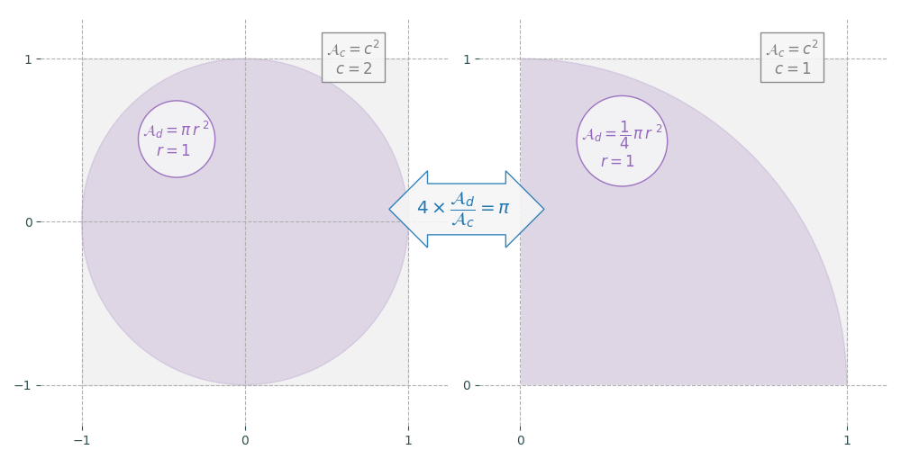

---
title: "Calcul de π par la méthode de Monte-Carlo"
date: 2021-03-14T22:38:02+01:00
description: "Optimisation de l’algorithme, choix d’un générateur de nombres pseudo-aléatoires (PRNG)."
#categories: [NumPy, Python]
head_pict: false
weight: 2
toc: false
dropCap: false
displayInMenu: true
displayInList: true
draft: false
katex: true
resources:
- name: featuredImage
  src: "pi_rouge.png"
  params:
    chapeau: "Ⅰ - Généralités"
    description: ""
---
# 1. Généralités
<br>

 <span class="lettrine">L</span>es [méthodes de Monte-Carlo](https://fr.wikipedia.org/wiki/M%C3%A9thode_de_Monte-Carlo "Wikipédia : Méthode de Monte-Carlo") sont des algorithmes permettant la résolution de problèmes d’optimisation, d’intégration ou d’échantillonnage. Elles reposent sur le tirage de nombres [pseudo-aléatoires](https://fr.wikipedia.org/wiki/Pseudo-al%C3%A9atoire "Wikipédia : Pseudo-aléatoire") dont l’[espérance](https://fr.wikipedia.org/wiki/Esp%C3%A9rance_math%C3%A9matique "Wikipédia : Espérance mathématique") de la distribution permet de calculer la quantité recherchée.

Ainsi, pour obtenir une approximation de [\(\pi\)](https://fr.wikipedia.org/wiki/Pi "Wikipédia : Pi") on peut tracer aléatoirement des points de coordonnées (x, y) uniformément répartis dans un carré de côté 1. Les coordonnées de chaque point sont des réels compris entre 0 et 1. Les points appartiennent au quart de disque de centre (0, 0) de rayon r = 1 inscrit dans le carré si et seulement si \(x^2+y^2\leq1\) . 

La probabilité qu’un point appartienne au quart de disque est \(\dfrac{\pi}{4}\). 

En effet, la surface du quart de disque est \(A_d=\dfrac{\pi \times r^2}{4}=\dfrac{\pi}{4}\), et celle du carré qui le contient \(A_c=c^2=1\). Le rapport \(\dfrac{A_d}{A_c}\) est donc \(\dfrac{\pi}{4}\).

Le rapport entre le nombre de points placés dans le disque et le nombre total tend vers le rapport des aires, soit \(\dfrac{\pi}{4}\), quand le nombre de points tend vers l’infini. L’approximation est d’autant plus précise que nombre de tirages est grand.

Une variante consiste à inscrire un disque complet centré en (0, 0) dans un carré de côté 2. Les coordonnées des points sont alors comprises entre -1 et 1. Le résultat est le même puisque les rapports des surfaces sont identiques&nbsp;: 


#### Choix d’un algorithme

L’algorithme va consister à générer des paires de nombres aléatoires x et y compris entre 0 et 1 (ou -1 et 1 selon les cas) qui formeront les [coordonnées cartésiennes](https://fr.wikipedia.org/wiki/Coordonn%C3%A9es_cart%C3%A9siennes "Wikipédia : Coordonnées cartésiennes") des points. Il suffira ensuite de compter ceux qui remplissent la condition \(x^2 + y^2\leq1\), c’est-à-dire qui sont situés à l’intérieur du cercle de centre (0, 0) et de rayon 1 puis à multiplier ce chiffre par 4 et à le diviser par le nombre total de points. Le résultat sera une approximation de \(\pi\).

Si nous appelons \(\pi_{mc}\) l’approximation obtenue&nbsp;:

$$\pi_{mc} = 4 \times \frac{ \mathrm{Nombre\ de\ points\ à\ lʼintérieur\ du\ cercle}}{\mathrm{Nombre\ de\ points\ total}}$$

Que la condition testée soit \(< 1\) (strictement inférieur) ou \(\leq 1\) (inférieur ou égal) est ici sans importance puisque la probabilité de tirer un point de coordonnées (1, 1) est nulle. Cela ressort naturellement du fait que l’intervalle entre 0 et 1 contient une infinité de réels.
De manière générale, si l’on note X la variable aléatoire qui, au tirage d’un nombre, associe ce nombre, alors pour tout réel x de [0, 1], P(X = x) = 0. 
 
#### Optimisation du traitement des données

Plus le nombre de points calculé est élevé, plus il devient indispensable d’utiliser un algorithme optimisé, sans quoi le temps de traitement peut rapidement devenir rédhibitoire. 

Une approche naïve consiste à générer des points un par un, par exemple au moyen d’une boucle `for`. 

Avec cette méthode, quel sera le temps nécessaire pour traiter un million de points&nbsp;?


```python
%%timeit
import random
acc = 0
for i in range(1_000_000):
    x = random.random()
    y = random.random()
    if (x ** 2 + y ** 2) < 1.0:
        acc += 1
pi_mc = 4.0 * acc / 1_000_000
```
<pre class="sortie">
531 ms ± 24.4 ms per loop (mean ± std. dev. of 7 runs, 1 loop each)
</pre>

_NB&nbsp;: `%%timeit` et `%timeit` sont des «&nbsp;[commandes magiques intégrées](https://ipython.readthedocs.io/en/stable/interactive/magics.html "ipython.readthedocs.io")&nbsp;» du terminal interactif [iPython](https://fr.wikipedia.org/wiki/IPython "Wikipédia : IPython") qui peuvent être exécutées dans le terminal ou dans l’environnement [Jupyter Notebook](https://jupyter.org/ "jupyter.org"). Elles permettent de mesurer très facilement la durée d’exécution d’une instruction ou d’une série d’instructions._ 

Le résultat peut être nettement amélioré si l’on utilise un [compilateur à la volée](https://fr.wikipedia.org/wiki/Compilation_%C3%A0_la_vol%C3%A9e "Wikipédia : Compilation à la volée") (*Just-in-time*) comme [Numba](https://en.wikipedia.org/wiki/Numba "Wikipedia : Numba"), par exemple. qui peut être installé avec le gestionnaire de paquets [_pip_](https://fr.wikipedia.org/wiki/Pip_(gestionnaire_de_paquets) "Wikipédia : pip (gestionnaire de paquets"))&nbsp;:


```
$ sudo pip install numba
```

C’est précisément le calcul de \(\pi\) par la méthode de Monte-Carlo qui est citée sur [la page d’accueil](http://numba.pydata.org/ "numba.pydata.org") de Numba comme exemple de code optimisé.

L’utilisation la plus simple de Numba consiste à ajouter un décorateur à la fonction que l’on souhaite accélérer.


```python
# source : http://numba.pydata.org/
from numba import jit
import random

@jit(nopython=True)
def monte_carlo_pi(nsamples):
    acc = 0
    for i in range(nsamples):
        x = random.random()
        y = random.random()
        if (x ** 2 + y ** 2) < 1.0:
            acc += 1
    return 4.0 * acc / nsamples
```

Quelle est cette fois la vitesse d’exécution de 1&#8239;000&#8239;000 de boucles&nbsp;?


```python
%timeit monte_carlo_pi(1_000_000)
```
<pre class="sortie">
17.5 ms ± 124 µs per loop (mean ± std. dev. of 7 runs, 1 loop each)
</pre>

Comme on le voit, Numba accélère grandement l’exécution du code, ici d’un facteur 30. Si l’on choisit un algorithme faisant appel à de nombreuses itérations, on aura tout intérêt à optimiser le code grâce à des solutions comme Numba, [cffi](https://pypi.org/project/cffi/ "pypi.org") ou [cython](https://cython.org/ "cython.org").

Cependant Numba ne supporte que certaines instructions de Python. Le [PCG64](https://numpy.org/doc/stable/reference/random/bit_generators/pcg64.html "numpy.org"), notamment, qui est la dernière version du générateur de nombres aléatoires de [NumPy](https://fr.wikipedia.org/wiki/NumPy "Wikipédia : NumPy") que nous verrons un peu plus loin, n’est pas reconnu par Numba.

Si l’on veut gagner du temps, sans passer par un compilateur comme Numba, il faut opter pour une approche un peu différente. Sur de grands volumes de chiffres, la vectorisation sera bien plus efficace que l’itération. C’est justement ce que propose NumPy.

NumPy permet d’exécuter très rapidement des programmes comportant de grandes quantités de chiffres grâce aux opérations sur les tableaux. On ne procède plus ici par itérations (on évite d’itérer sur les tableaux) mais en utilisant des fonctions vectorisées qui s’appliquent à tous les éléments d’un tableau.

La fonction de calcul de \(\pi_{mc}\) que l’on a vue plus haut peut être réécrite pour NumPy de la façon suivante&nbsp;:


```python
import numpy as np

# Initialisation du générateur de nombres aléatoires
rng = np.random.default_rng() 

def mc_pi_numpy(nsamples):
    tab_xy = rng.random((nsamples, 2))
    acc = np.sum(tab_xy[:, 0]**2 + tab_xy[:, 1]**2 < 1)
    return 4.0 * acc / nsamples
```

Bien que le temps d’exécution soit un peu plus long qu’avec Numba, il est du même ordre de grandeur&nbsp;:


```python
%timeit mc_pi_numpy(1_000_000)
```

<pre class="sortie">
27.6 ms ± 503 µs per loop (mean ± std. dev. of 7 runs, 10 loops each)
</pre>

Avec NumPy, comme on le voit, on se contente de créer un tableau de \(n\times 2\) nombres aléatoires puis on applique à ce tableau des fonctions qui sont mises en œuvre sur l’ensemble des éléments sans qu’il soit nécessaire d’itérer. 

Cependant, si le nombre de points calculés devient très grand, tous les éléments du tableau étant stockés dans la mémoire, celle-ci risque d’être assez rapidement saturée.

#### Répartir les données

Si l’on essaie de créer un tableau d’un milliard de points, il y a des chances que ça ne passe pas.


```python
mc_pi_numpy(1_000_000_000) # un milliard (10⁹) 
```

Même sur les serveurs _cloud_ de Google, avec [Colab](https://colab.research.google.com/notebooks/intro.ipynb "colab.research.google.com") (version non professionnelle), cette instruction provoque un crash du kernel&nbsp;:

>Votre session a planté après avoir utilisé toute la mémoire RAM disponible. Si vous êtes intéressé par un accès à des environnements d’exécution à mémoire RAM élevée, nous vous conseillons Colab Pro.

```tcmalloc: large alloc 16000000000 bytes == [...]```

Cette limite peut être repoussée en allouant plus de [RAM](https://fr.wikipedia.org/wiki/M%C3%A9moire_vive "Wikipédia : Mémoire vive") aux calculs mais elle n’en est pas moins un obstacle si l’on veut obtenir des résultats sur un grand nombre de points (au-delà d’un milliard).

Pour contourner le problème, il suffira d’ajouter une boucle qui permettra de répartir les coordonnées des points sur plusieurs tableaux. Au lieu de créer un tableau contenant 10<sup>9</sup> données, on pourra parcourir 10 tableaux qui en comportent chacun 10<sup>8</sup>, 100 qui en contiennent 10<sup>7</sup>, etc. 

#### Précision des calculs
    
Une autre limite à laquelle on va devoir faire face, est celle de la précision des calculs. Les nombres à [virgule flottante](https://fr.wikipedia.org/wiki/Virgule_flottante "Wikipédia : Virgule flottante") sur 64 bits sont le `dtype` ([Data type objects](https://numpy.org/devdocs/reference/arrays.dtypes.html "numpy.org")) par défaut utilisé par la fonction `np.random.default_rng()`. Ici, la précision n’est pas en problème en soi puisqu’il s’agit de nombres aléatoires dont on attend seulement qu’ils soient uniformément répartis.
    
En revanche, au moment du calcul final qui donne la valeur \(\pi_{mc}\) à partir d’opérations entre trois entiers, on aura besoin d’une grande précision si l’on souhaite exploiter les résultats au-delà de quelques décimales. 

On utilisera pour cela le module [_decimal_](https://docs.python.org/3/library/decimal.html "docs.python.org") de la [bibliothèque standard](https://docs.python.org/fr/3/library/index.html "docs.python.org"), qui permet de faire des calculs sur les nombres à virgule flottante avec une précision aussi grande que souhaitée.

Supposons par exemple qu’un programme crée 26&#8239;805&#8239;949&#8239;036 points aléatoires que, sur ce nombre, 21&#8239;053&#8239;343&#8239;141 appartiennent au disque. 

Il faut pouvoir interpréter ce résultat et savoir combien l’opération \(4\times\)\( \dfrac{21 \, 053 \,343 \, 141}{26 \, 805 \, 949 \, 036}\) va donner de décimales de \(\pi\) exactes.

Par défaut, la précision n’est pas suffisante pour répondre à cette question :


```python
print(4 * 21_053_343_141 / 26_805_949_036)
```
<pre class="sortie">
3.141592653589793
</pre>

On voit simplement que l’on a obtenu *au moins* 15 décimales exactes (en supposant que la dernière affichée ne soit pas un arrondi), mais nous n’en savons pas beaucoup plus. C’est ici que le module _decimal_ révèle toute son utilité.


```python
from decimal import Decimal, getcontext
getcontext().prec = 32
getcontext().rounding = 'ROUND_DOWN'

print((4 * Decimal(21_053_343_141) / 
       Decimal(26_805_949_036)).quantize(Decimal('.'+'0'*30)))
```
<pre class="sortie">
3.141592653589793238462381742774
</pre>

- Dans cet exemple, on a fixé la précision à plus de 30 chiffres après la virgule et l’on constate que l’opération nous donne des valeurs de \(\pi\) exactes jusqu’à la 21e décimale.

- Le choix de `ROUND_DOWN` pour arrondir les résultats permettra par exemple d’afficher 1,666...666 au lieu de 1,666...667 comme résultat de l’opération 10&nbsp;/&nbsp;6. Car ce qui nous intéresse ici, c’est d’obtenir le plus grand nombre de décimales exactes, pas forcément d’afficher la valeur la plus proche au sens mathématique.

- La méthode `quantize()` permet d’afficher le résultat avec le nombre de décimales souhaité. 

- La précision utilisée dans les calculs doit être un peu supérieure à la précision d’affichage, car elle doit tenir compte des erreurs accumulées lors des arrondis.

La fonction de calcul des \(\pi_{mc}\) peut donc être améliorée grâce à la répartition des calculs entre plusieurs tableaux et à l’utilisation du module _decimal_ pour le calcul final&nbsp;:


```python
import numpy as np
import decimal as d
c_func = d.Context(prec=32, rounding='ROUND_DOWN')

rng = np.random.default_rng() 

def mc_pi_numpy(ntab, loops):
    d.setcontext(c_func)
    acc = 0
    for _ in range(loops):
        tab_xy = rng.random((ntab, 2))
        acc += np.sum(tab_xy[:, 0]**2 + tab_xy[:, 1]**2 < 1)
    return (4 * d.Decimal(int(acc) / 
            d.Decimal(ntab * loops))).quantize(d.Decimal('.'+'0'*30))
```

On peut cette fois obtenir des approximations pour un nombre de points élevé, et afficher le résultat avec toute la précision souhaitée&nbsp;:

```python
# 10⁶ x 10³ soit 10⁹
pi_mc1 = mc_pi_numpy(1_000_000, 1_000) 
# 12_345_678 x 89 soit 1_098_765_342
pi_mc2 = mc_pi_numpy(1_234_567, 89)   
print(f'pi_mc1 : {pi_mc1}\npi_mc2 : {pi_mc2}') 
```
<pre class="sortie">
pi_mc1 : 3.141645392000000000000000000000
pi_mc2 : 3.141692247592644113416719648137
</pre>
<br>
<p style="text-align:center;">&#8258;</p> 

#### Le générateur de nombres pseudo-aléatoires ([PRNG](https://fr.wikipedia.org/wiki/G%C3%A9n%C3%A9rateur_de_nombres_pseudo-al%C3%A9atoires "Wikipédia : Générateur de nombres pseudo-aléatoires"))

Puisque la génération de nombres pseudo-aléatoires est au cœur de l’algorithme, sa vitesse d’exécution sera déterminante. Examinons quelques-unes des solutions proposées par Python pour créer des séquences aléatoires et comparons leurs durées d’exécution pour des blocs de 1&#8239;000 nombres, uniformément répartis entre 0 et 1&nbsp;:

```python
import random
import numpy as np
# algorithme Mersenne Twister de la bibliothèque standard
%timeit [random.random() for _ in range(1000)]
# NumPy - Mersenne Twister MT19937 (legacy)
%timeit np.random.rand(1000) 
# NumPy - PCG64 (nouvelle version)
rng = np.random.default_rng()
%timeit rng.random(1000)
```
<pre class="sortie">
122 µs ± 6.12 µs per loop (mean ± std. dev. of 7 runs, 10000 loops each)
13.2 µs ± 32.7 ns per loop (mean ± std. dev. of 7 runs, 100000 loops each)
9.36 µs ± 422 ns per loop (mean ± std. dev. of 7 runs, 100000 loops each)
</pre>

La première méthode est celle fournie par la [bibliothèque standard](https://docs.python.org/fr/3/library/ "docs.python.org") de Python. Ce n’est évidemment pas la plus efficace pour remplir des tableaux puisqu’il faut procéder soit par itération, soit par compréhension de liste, comme dans l’exemple ci-dessus. 

La seconde fait appel au [Mersenne Twister MT19937](https://fr.wikipedia.org/wiki/Mersenne_Twister "Wikipédia : Mersenne Twister") de NumPy qui a été conservé comme [système hérité (legacy)](https://numpy.org/doc/stable/reference/random/legacy.html "numpy.org") par souci de compatibilité ascendante, mais qui n’est plus la façon officiellement recommandée de générer des nombres pseudo-aléatoires.

La troisième méthode est fondée sur un nouvel algorithme développé en 2014, le [PCG64](https://numpy.org/doc/stable/reference/random/bit_generators/pcg64.html "numpy.org") de la famille des Générateurs congruentiels permutés. C’est cette version qu’il est actuellement conseillé d’utiliser, et c’est aussi la plus rapide.

Nous ne nous intéresserons ici qu’à la distribution uniforme mais toutes les distributions sont implémentées. Entre l’ancien algorithme et le nouveau, les correspondances sont indiquées sur [cette page](https://numpy.org/doc/stable/reference/random/index.html "numpy.org").

Le constructeur recommandé par NumPy, `np.random.default_rng()` est un alias de `Generator(PCG64())`. Initialisés avec la même [graine aléatoire (_seed_)](https://fr.wikipedia.org/wiki/Graine_al%C3%A9atoire "Wikipédia : Graine aléatoire"), ils donneront les mêmes résultats&nbsp;:


```python
from numpy.random import Generator, PCG64
rng1 = np.random.default_rng(seed=42)
rng2 = Generator(PCG64(seed=42))
print('rng1 :', rng1.random(5))
print('rng2 :', rng2.random(5))
```

<pre class="sortie">
rng1 : [0.77395605 0.43887844 0.85859792 0.69736803 0.09417735]
rng2 : [0.77395605 0.43887844 0.85859792 0.69736803 0.09417735]
</pre>

#### Reproductibilité

La reproductibilité d’une séquence de nombres aléatoires est assurée par le choix d’une graine aléatoire qui peut être un entier ou une séquence d’entiers (tableau NumPy, _tuple_, liste...) à partir de laquelle la même suite de nombres aléatoires sera générée.

Par défaut, si l’on ne fournit pas de _seed_, la valeur initiale dépendra de l’entropie du système d’exploitation qui n’est en principe pas reproductible. 

Voici deux exemples affichant 3 séquences de 5 nombres, l’un sans _seed_, l’autre avec _seed_&nbsp;:


```python
# sans seed
for _ in range(3):
    rng1 = np.random.default_rng() 
    print(rng1.random(5))  

# avec seed
print()
for _ in range(3):
    rng2 = np.random.default_rng(seed=12345)
    print(rng2.random(5))
  
```
<pre class="sortie">
[0.65530925 0.1851834  0.86324729 0.39255347 0.3878601 ]
[0.47366815 0.22243056 0.32236095 0.51787121 0.79535642]
[0.88876466 0.14850372 0.12622366 0.66145    0.43773946]
    
[0.22733602 0.31675834 0.79736546 0.67625467 0.39110955]
[0.22733602 0.31675834 0.79736546 0.67625467 0.39110955]
[0.22733602 0.31675834 0.79736546 0.67625467 0.39110955]
</pre>

Dans le premier cas, même réinitialisé, le générateur produit des séquences différentes à chaque fois. Les séquences ne seront pas reproductibles. Dans le second cas, initialisé avec le même _seed_, il produit toujours la même séquence. 

#### Boucles et appariements

Une autre condition importante pour assurer la reproductibilité des résultats a trait à l’ordre dans lequel sont générés les nombres pseudo-aléatoires. 

Chaque point étant représenté par deux coordonnées du plan x et y, il faut deux nombres aléatoires pour le caractériser.

Pour construire 6 points, la disposition suivante en deux tableaux est possible, l’un pour les abscisses, l’autre pour les ordonnées&nbsp;:

\[
\textnormal{X} = \left[ \begin{array}
{lll}
r_1 & r_2 & r_3\\
r_4 & r_5 & r_6
\end{array} \right]
\quad
\textnormal{Y} = \left[ \begin{array}
{lll}
r_7 & r_8 & r_9 \\
r_{10} & r_{11} & r_{12}
\end{array} \right] 
\]

L’ordre dans lequel seront enregistrés les éléments de la suite aléatoire \((r_1, r_2, r_3,...)\) est celui qui est naturellement suivi par NumPy si on lui donne les instructions ```X = rng.random((2, 3))``` et ```Y = rng.random((2, 3))```. Dans ce cas, il remplira les deux tableaux, l’un après l’autre, ligne par ligne. Les nombres de la suite aléatoire seront donc rangés dans l’ordre indiqué ci-dessus.

Si l’on choisit un tableau pour les x et un autre pour les y, les points générés auront donc pour coordonnées \(P_1(r_1, r_7), P_2(r_2, r_8)... \) jusqu’à \(P_{6}(r_6, r_{12}\)).

Cette construction ne présente pas de problème particulier et semble même assez intuitive. Elle a néanmoins l’inconvénient d’associer les paires x et y d’une façon qui dépend du nombre d’éléments présents dans les tableaux. Si le nombre d’éléments est différent les associations seront différentes&nbsp;:

\[
\textnormal{X} = \left[\begin{array}
{lll}
r_1 & r_2\\
r_3 & r_4
\end{array} \right]
\quad
\textnormal{Y} = \left[\begin{array}
{lll}
r_5 & r_6\\
r_7 & r_8
\end{array} \right]
\]

Cette fois, on a \(P_1(r_1, r_5)\), puis \(P_2(r_2, r_6), P_3(r_3, r_7)\) et \(P_4(r_4, r_8)\). Autrement dit, ce ne seront pas les mêmes points que ceux du modèle précédent puisque la taille des tableaux ayant été modifiée, les associations formant les paires (x, y) ne sont pas les mêmes.

Même si l’on a pris soin de choisir un même _seed_, les résultats ne seront pas reproductibles pour peu que le nombre d’éléments varie. 

Pour éviter cela, on aura tout intérêt —&nbsp;quand la reproductibilité a une importance&nbsp;— à associer entre eux des nombres consécutifs de la suite pseudo-aléatoire pour former les paires (x, y). De cette façon, elles resteront constantes, indépendamment de la dimension des tableaux. 


```python
tab_xy=[]
for n in (6, 4):
    rng = np.random.default_rng(42)
    tab_xy.append(rng.random((n, 2)))
tab1, tab2 = tab_xy
```
Ici, quelle que soit la taille des tableaux, les paires (x, y) sont constantes&nbsp;:

```python
print('tableau 1 :\n', tab1)
```
<pre class="sortie">
tableau 1 :
    [[0.77395605 0.43887844]
    [0.85859792 0.69736803]
    [0.09417735 0.97562235]
    [0.7611397  0.78606431]
    [0.12811363 0.45038594]
    [0.37079802 0.92676499]]
</pre>

```python
print('tableau 2 :\n', tab2)
```
<pre class="sortie">
tableau 2 :
    [[0.77395605 0.43887844]
    [0.85859792 0.69736803]
    [0.09417735 0.97562235]
    [0.7611397  0.78606431]]
</pre>

Les 4 premiers points sont communs aux tableaux 1 et 2 puisqu’ils ont les mêmes coordonnées.

Cette stabilité se retrouve aussi dans le cas de boucles parcourant successivement plusieurs tableaux. Pour un _seed_ déterminé, le parcours de 10 tableaux contenant les coordonnées de 10&#8239;000 points donnera le même résultat que celui de 100 tableaux contenant les coordonnées de 1&#8239;000 points.

Illustration avec cette fonction qui renvoie le nombre de «&nbsp;succès&nbsp;», c’est-à-dire le nombre de points placés dans le cercle&nbsp;:


```python
import numpy as np

def in_circle(ntab, loops):
    rng = np.random.default_rng(seed=42) # on fournit un seed 
    nb_cible = 0
    for _ in range(loops):
        tab_xy = rng.random((ntab, 2))
        nb_cible += np.sum(tab_xy[:, 0]**2 + tab_xy[:, 1]**2 < 1)
    return nb_cible

# 10 tableaux de 10_000 éléments
print('Pour 10 000 x 10 :', in_circle(10_000, 10))
# 100 tableaux de 1_000 éléments
print('Pour 1 000 x 100 :', in_circle(1_000, 100)) 
```
<pre class="sortie">
Pour 10 000 x 10 : 78752
Pour 1 000 x 100 : 78752
</pre>

 #### La méthode `advance()`
 
Le générateur de nombres pseudo-aléatoires (PRNG) produit donc une séquence de nombres \(r_1, r_2, r_3, r_4,...\) qui sera toujours la même pour un _seed_ déterminé. 

Il est même possible de passer directement à \(r_n\) sans avoir à calculer ou afficher les éléments précédents. Grâce à la méthode [`advance()`](https://numpy.org/doc/stable/reference/random/bit_generators/generated/numpy.random.PCG64.advance.html "numpy.org"), une fonction peu connue du PCG64, on peut en effet sauter une partie de la séquence et appeler directement la valeur de rang _n_ du générateur. 

Dans le cas de la simulation de Monte-Carlo, cela peut-être utile si l’on connaît déjà la proportion de succès (le nombre de points dans la cible) pour un nombre total _n_ de points donnés, cette valeur étant bien sûr associée à un _seed_ déterminé. On peut alors commencer à créer des points aléatoires directement à partir de _n+1_ avec le même _seed_ sans avoir à lancer le programme à partir de 0. C’est le principal intérêt de cette méthode.

En voici une illustration. On passe à la fonction le nombre de points placés dans la cible \((nb\_cible_1)\) sur un nombre total \(nb\_total_1\), et on lui indique un autre nombre total de points \(nb\_total_2\) (avec \(nb\_total_2 > nb\_total_1\)) pour lequel on souhaite connaître \(nb\_cible_2\). La fonction renvoie la valeur de \(nb\_cible_2\) après avoir traité uniquement les points situés entre \(nb\_total_1\) et \(nb\_total_2\)&nbsp;:


```python
import numpy as np
from numpy.random import Generator, PCG64

def in_circle_plus(seed, nb_total1, nb_total2, nb_cible1):
    # on avance au rang n1*2 car chaque point compte 2 coordonnées
    rng = Generator(PCG64(seed).advance(nb_total1*2))
    # on ne calcule que les points entre n1 et n2
    tab_xy = rng.random((nb_total2 - nb_total1, 2)) 
    return nb_cible1 + np.sum(tab_xy[:, 0]**2 + tab_xy[:, 1]**2 < 1)

seed = 42                  # graine aléatoire
nb_total1 = 70_000_000     # nombre total de points au départ
# nombre de points à l’intérieur du cercle pour la valeur de n1
nb_cible1 = 54_979_074
# nombre de points total pour lequel on veut connaître nb_cible2   
nb_total2 = 80_000_000     

nb_cible2 = in_circle_plus(seed, nb_total1, nb_total2, nb_cible1)
print('nb_cible2 =', nb_cible2)
```
<pre class="sortie">
nb_cible2 = 62833685
</pre>

On peut s’assurer que cette valeur est bien celle que l’on aurait obtenue si l’on avait calculé tous les points à partir de 0&nbsp;:


```python
# cette fois, nb_total1 et nb_cible1 sont remis à zéro
nb_cible2_verif = in_circle_plus(seed, 0, nb_total2, 0) 
print('nb_cible2_verif =', nb_cible2_verif)
```
<pre class="sortie">
nb_cible2_verif = 62833685
</pre>

On obtient bien le même résultat. Mais le traitement est bien plus rapide avec `advance()`. Dans cet exemple, on a économisé pas moins de 7 huitièmes du temps de calcul.


```python
# avec advance
%timeit in_circle_plus(seed, nb_total1, nb_total2, nb_cible1)
# sans advance
%timeit in_circle_plus(seed, 0, nb_total2, 0)
```
<pre class="sortie">
236 ms ± 1.08 ms per loop (mean ± std. dev. of 7 runs, 1 loop each)
1.94 s ± 39.5 ms per loop (mean ± std. dev. of 7 runs, 1 loop each)
</pre>

Cette méthode n’a bien sûr d’intérêt que si l’on veut reproduire une séquence de nombres aléatoires avec un _seed_ déterminé.

En toute logique, on remarque que `Generator(PCG(seed).advance(0))` génère le 1er terme de la suite, exactement comme si l’on n’avait pas utilisé la méthode `advance()`.

Les trois instructions suivantes sont équivalentes et donnent les mêmes résultats&nbsp;:


```python
rng1 = Generator(PCG64(42).advance(0))
rng2 = Generator(PCG64(42))
rng3 = np.random.default_rng(42)
for rng in (rng1, rng2, rng3):
    print(rng.random())
```
<pre class="sortie">
0.7739560485559633
0.7739560485559633
0.7739560485559633
</pre>

Toutefois, NumPy évolue constamment et il n’est pas certain que le PCG64 restera le générateur par défaut dans les versions futures&nbsp;:

>The default is currently PCG64 but this may change in future versions. As a convenience NumPy provides the default_rng function to hide these details. [[doc]](https://numpy.org/doc/stable/reference/random/index.html#introduction "numpy.org")
