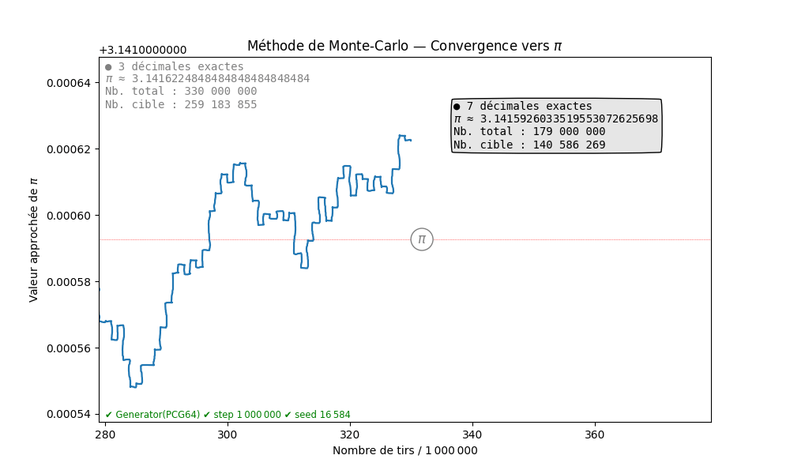

# 4. Convergences
<br>


<span class="lettrine">P</span>uisque c’est à partir de fractions que sont calculées les approximations \(\pi_{mc}\,\), le module [_fractions_](https://docs.python.org/fr/3/library/fractions.html "docs.python.org") de Python pourra nous être utile pour trouver les meilleures approximations de \(\pi\). Une fois connues, il suffira de «&nbsp;forcer le hasard&nbsp;» pour que le PRNG de NumPy nous amène précisément à ces résultats.

#### La méthode des fractions
La documentation officielle de Python est ici particulièrement éclairante puisque c’est justement une approximation de \(\pi\) qui a été choisie pour illustrer la fonction [`limit.denominator()`](https://docs.python.org/fr/3/library/fractions.html#fractions.Fraction.limit_denominator "docs.python.org") du module _fractions_ :


```python
# Réf. https://docs.python.org/3/library/fractions.html#module-fractions
from fractions import Fraction
Fraction('3.1415926535897932').limit_denominator(1_000)
```
<pre class="sortie">
Fraction(355, 113)
</pre>


Nous retrouvons [Milü 密率](https://en.wikipedia.org/wiki/Mil%C3%BC "Wikipedia : Milü"), la fameuse approximation de Zu Chongzhi. 

Il n’est pas difficile de construire, autour de cette fonction, un programme qui aura pour objet de répertorier, pour une plage d’entiers donnée, les fractions donnant les approximations de \(\pi\) les plus intéressantes. 

L’idée est d’incrémenter une variable qui va représenter la limite du dénominateur, de façon à obtenir différentes fractions proches de \(\dfrac{\pi}{4}\) pour un rang déterminé d’entiers. 

Car c’est bien \(\dfrac{\pi}{4}\) que l’on va chercher à représenter sous forme de fraction, et non pas \(\pi\) lui-même. Ainsi, le numérateur nous donnera directement le nombre de points placés à l’intérieur du cercle, tandis que le dénominateur indiquera le nombre total de points.

On devrait donc rencontrer parmi ces fractions remarquables 355&nbsp;/&nbsp;452 et non pas 355&nbsp;/&nbsp;113 puisque c’est \(4\times\dfrac{355}{452}\) qui nous donnera l’approximation de \(\pi\).
Quant au pas d’incrément (_step_), il doit pouvoir être modifié de façon à filtrer les résultats.


```python
from fractions import Fraction
from decimal import Decimal as D, getcontext
from tabulate import tabulate # présentation sous forme de tableau
                              # Cf. https://pypi.org/project/tabulate/
from pi_string import pi      # module local (voir plus haut, partie II)

precision = 30                # la précision peut être augmentée si nécessaire
pi_ref = pi(precision)        # π sous forme de string avec 30 décimales
getcontext().prec += 4        # + de précision pour les calculs
pi_quart = (D(pi_ref)/4).quantize(D(pi_ref)) # π/4 avec 30 décimales

den_lim = 1
results = []

def get_digits(pi_mc):
    """Renvoie le nombre de décimales exactes pour une valeur approchée de π"""
    k = 0
    while pi_mc[:k] in pi_ref :
        k += 1
    return max(k - 3, 0)

# Programme principal
for i in range(1, 1_000_000, 10_000): 
    """
    Calcule pour une plage d’entiers donnée les fractions qui donnent les
    valeurs les plus proches de π.
    """
    fpi = Fraction(pi_quart).limit_denominator(i)
    num, den = fpi.numerator, fpi.denominator
    if den > den_lim:
        den_lim = den
        pi_mc = str((4 * D(num) / D(den)).quantize(D(pi_ref)))
        results.append((den, num, pi_mc, get_digits(pi_mc)))

# tri, formatage et affichage des résultats
results.sort(key= lambda x: x[3]) # tri par nombre de décimales
headers=['Total', 'Cible', 'Valeur approchée de π', 'Nb déc.']
print(tabulate(results, 
               headers, 
               disable_numparse=True, 
               colalign=(4*'right'.split())))
```
<pre class="sortie">

  Total    Cible            Valeur approchée de π    Nb déc.
-------  -------  --------------------------------  ---------
    452      355  3.141592920353982300884955752212          6
  19655    15437  3.141592470109386924446705672856          6
  29599    23247  3.141592621372343660258792526774          7
  33215    26087  3.141592653921421044708715941592          9
 198838   156167  3.141592653315764592281153501845          9
 232053   182254  3.141592653402455473534063338978          9
 265268   208341  3.141592653467436705520454785349          9
 298483   234428  3.141592653517955796477521332873         10
 331698   260515  3.141592653558357300918305205337         10
 364913   286602  3.141592653591403978482542414219         10

</pre>

Le calcul est très rapide et permet d’obtenir quasi-instantanément des fractions approchant \(\pi\) avec une grande précision pour des valeurs élevées de _n_.
Si l’on calcule les fractions possibles jusqu’à un nombre de points de 1 milliard avec un pas d’incrément de 100 millions (ce qui filtre beaucoup de résultats), on obtient&nbsp;:

<pre class="sortie">
    Total      Cible            Valeur approchée de π    Nb déc.
---------  ---------  --------------------------------  ---------
 27235615   21390802  3.141592653589794098646202775299         14
183749173  144316263  3.141592653589793299369026275835         16
340262731  267241724  3.141592653589793235392564929480         17
</pre>

La valeur donnant le résultat le plus proche de \(\pi\) obtenue pour un nombre total de points inférieur à un milliard (10<sup>9</sup>) est celle qui correspond à 267&#8239;241&#8239;724 points placés dans la cible sur un total de 340&#8239;262&#8239;731. La précision atteinte est alors de 17 décimales&nbsp;!

Le plafond des 20 décimales exactes est atteint (et dépassé) pour _n_ = 26&#8239;805&#8239;949&#8239;036 :

<pre class="sortie">
      Total        Cible            Valeur approchée de π    Nb déc.
-----------  -----------  --------------------------------  ---------
26805949036  21053343141  3.141592653589793238462381742774         21
</pre>

Grâce à la puissance conjuguée des modules _fractions_ et _decimal_, la précision théorique que l’on peut atteindre est quasiment sans limite. 

Pour aller plus loin, il suffit d’augmenter la valeur de la variable `precision` que nous avons ici arbitrairement fixée à 30.

Ainsi, en choisissant une précision \(> 50 \) et en faisant une recherche sur la plage `range(int(1e25), int(1e25),int(1e24))`, on trouve facilement que la première fraction, dans l’ordre des _n_ croissants, à donner une approximation de \(\pi\) avec 50 décimales exactes, est obtenue à partir des valeurs suivantes&nbsp;:

<pre class="sortie">
Total : 33 297 080 577 553 090 318 600 632
Cible : 26 151 465 932 107 044 561 886 949
</pre>

Il est facile de le vérifier&nbsp;:

```python
from decimal import Decimal as D, getcontext
getcontext().prec = 60
4 * D(26_151_465_932_107_044_561_886_949) / D(33_297_080_577_553_090_318_600_632)
```
<pre class="sortie">
Decimal('3.14159265358979323846264338327950288419716939937510414085630')
</pre>

Cela nous donne bien une valeur de \(\pi\) exacte jusqu’à la cinquantième décimale :
```python
from pi_string import pi
print(pi(50))
```
<pre class="sortie">
3.14159265358979323846264338327950288419716939937510
</pre>

On notera que la fonction `range()` n’accepte que les entiers, ce qui explique que les nombres utilisant la [notation scientifique](https://fr.wikipedia.org/wiki/Notation_scientifique "Wikipédia : Notation scientifique") (1e25 pour 10<sup>25</sup>, considérés comme des flottants doivent être passés comme arguments sous la forme `int(1e25)`. Il est aussi possible (quoique fastidieux) de noter 1 suivi de 25 zéros.

Nous nous sommes ici appuyés sur la méthode `limit_denominator()` de la classe `Fraction` du module _fractions_ qui permet de trouver des approximations rationnelles de nombres flottants.


Une autre approche possible est d’utiliser la puissance de NumPy pour chercher par itération les tirages pour lesquels l’espérance de la loi binomiale \(\mathit{B}\left(n, \dfrac{\pi}{4}\right)\) est proche d’un entier.



#### La méthode des entiers

Intuitivement, on comprend que puisque la loi binomiale \(\mathit{B}\left(n, \dfrac{\pi}{4}\right)\) a pour espérance \(n\times\dfrac{\pi}{4}\), si cette espérance est proche d’un entier, alors cet entier, une fois multiplié par 4 et divisé par _n_ sera proche de \(\pi\). 

Prenons l’exemple de l’approximation de Zu Chongzhi citée plus haut, 355&nbsp;/&nbsp;113 qui nous donne 6 décimales exactes. C’est la fraction 355&nbsp;/&nbsp;452 que nous chercherons puisque, une fois multipliée par 4, elle donnera le résultat attendu.

L’espérance de la loi binomiale pour cette valeur de _n_ est \(n\times\dfrac{\pi}{4}\), soit&nbsp;:


```python
from math import pi
452 * pi / 4
```
<pre class="sortie">
354.9999698556466
</pre>

Comme on le voit, ce chiffre est très proche de 355. C’est la raison pour laquelle la fraction 355&nbsp;/&nbsp;113 est une aussi bonne approximation de \(\pi\).

L’idée sera donc d’incrémenter une variable, de calculer le produit de cette variable par \(\dfrac{\pi}{4}\) (probabilité de la loi binomiale), et de filtrer les résultats pour ne garder que les valeurs les plus proches d’un entier. 

Le programme ci-dessous est fondé sur ce principe. Il permet de calculer les \(\pi_{mc}\) pour des tranches d’entiers données. Comme nous nous intéressons surtout au nombre de décimales exactes, une procédure de comptage a été ajoutée pour n’afficher que les résultats qui présentent un nombre minimal de décimales exactes.


```python
from tabulate import tabulate
import numpy as np
from decimal import Decimal as D, getcontext
from pi_string import pi         # module local (voir plus haut)


###############################################################################
# Paramètres modifiables :

alpha = 1              # borne inférieure de la tranche d’entiers 
omega = 1_000_000      # borne supérieure
dec_min = 10           # nombre minimum de décimales exactes recherchées
###############################################################################

pi_ref = pi(30)                  # valeur de π de référence (30 décimales)
getcontext().prec += 4           # augmentation de la précision pour calculs
prob = np.longdouble(pi_ref) / 4 # probabilité de la loi binomiale (π/4)

n_prox = 100        # nombre d’éléments analysés dans une tranche donnée
tabsize = int(1e6)  # taille des tableaux
results = []

def get_digits(pi_mc):
    """Renvoie le nombre de décimales exactes pour une valeur approchée de π"""
    k = 0
    while pi_mc[:k] in pi_ref :
        k += 1
    return max(k - 3, 0)

def checking_arrays(n_start, n_end):
    """
    Récupère les *n_prox* (= 100 par défaut) éléments d’un tableau d’entiers 
    dont le produit par *prob* (= π/4) est le plus proche (par excès ou 
    par défaut) d’un entier, calcule le produit de cet entier par π/4 et 
    vérifie le nombre de décimales exactes de π exactes que compte le résultat, 
    enfin l’ajoute à la liste *result* si le nombre de décimales exactes est 
    supérieur ou égal à *n_dec*.
    """
    tab = np.arange(n_start, n_end)
    esp = tab * prob

    s_int = np.rint(esp)
    s_id = np.argpartition(abs(s_int - esp), n_prox)
    
    s_tab = tab[s_id[:n_prox]]
    s_ins = s_int[s_id[:n_prox]].astype(np.int64)

    for ins, nx in sorted(zip(s_ins, s_tab)):
        pi_mc = str((4 * ins / D(int(nx))).quantize(D(pi_ref)))
        n_dec = get_digits(pi_mc)
        if n_dec >= dec_min:
            results.append((nx, ins, pi_mc, n_dec))

# programme principal

floor, remain = divmod(omega - alpha, tabsize)
loops = [tabsize for i in range(floor)]+([remain] if remain else [])

for i, loop in enumerate(loops):
    start = alpha + i*tabsize
    end = start + loop
    checking_arrays(start, end)
    
# tri, formatage et affichage des résultats
if results:
    results.sort(key= lambda x: x[3]) # tri par nombre de décimales
    headers=['Total', 'Cible', 'Valeur approchée de π', 'Nb déc.']
    print(tabulate(results, 
                   headers,
                   disable_numparse=True, 
                   colalign=(4*'right'.split())))

else:
    print(f"Aucun résultat de {dec_min} décimales pour n \u2208 " 
          f"[{alpha};{omega}].")
```
<pre class="sortie">
  Total    Cible             Valeur approchée de π    Nb déc.
-------  -------  --------------------------------  ---------
 298483   234428  3.141592653517955796477521332873         10
 331698   260515  3.141592653558357300918305205337         10
 364913   286602  3.141592653591403978482542414219         10
 596966   468856  3.141592653517955796477521332873         10
 630181   494943  3.141592653539221271349025121354         10
 663396   521030  3.141592653558357300918305205337         10
 696611   547117  3.141592653575668486429298417624         10
 729826   573204  3.141592653591403978482542414219         10
 862234   677197  3.141592653502413497959950547067         10
 895449   703284  3.141592653517955796477521332873         10
 928664   729371  3.141592653532386309795577302447         10
 961879   755458  3.141592653545820212313607012940         10
 995094   781545  3.141592653558357300918305205337         10
</pre>

Bien que ce programme soit un peu plus lent que le précédent, il donne bien plus de résultats. Le module _fractions_ réduit automatiquement les fractions, alors qu’ici elles sont présentes sous une forme non simplifiée pour autant qu’elles soient dans la tranche analysée. 

Ainsi, en lançant une recherche sur la tranche [1; 10&#8239;000] avec un minimum demandé de 6 décimales, on obtient plus d’une vingtaine de résultats, là où le programme fondé sur le module _fractions_ ne renvoie que l’approximation de Zu Chongzhi comme résultat à 6 décimales.

Ces deux programmes complémentaires permettent de trouver des couples d’entiers _n_ et _nb_cible_ tels que \(4\times\dfrac{nb\_cible}{n}\) donne un résultat proche de \(\pi\) pour la précision demandée.

Les couples ainsi obtenus sont dans un rapport idéal, donnant le maximum de précision au calcul de \(\pi\) par la méthode de Monte-Carlo.  

<p style="text-align:center;">&#8258;</p> 

#### Probabilités

Quelles sont les chances de tomber *par hasard* sur l’un de ces résultats remarquables en traçant des points aléatoires avec le PRNG de NumPy&nbsp;? 

Intuitivement, il semble évident que la probabilité de «&nbsp;tomber&nbsp;» sur l’une de ces paires convoitées est plus grande si le nombre de points est petit.

Pour en faire l’expérience, lançons au hasard le générateur de NumPy pour voir combien de boucles il lui faut pour arriver, en tirant au hasard 452 points, à en placer exactement 355 à l’intérieur du cercle, donnant ainsi le ratio de Zu Chongzhi&nbsp;:


```python
import numpy as np

rng = np.random.default_rng()
count = 1

def get_in_circle(n):
    tab = rng.random((n, 2))
    return np.sum(tab[:, 0]**2 + tab[:, 1]**2 < 1)

while get_in_circle(452) != 355:
    count += 1

print("Nombre de boucles :", count)
```
<pre class="sortie">
Nombre de boucles : 13
</pre>

Le résultat est différent à chaque fois qu’on lance le programme et peut varier de 1 à plusieurs dizaines. En outre, il n’est pas reproductible puisque le _seed_ du PRNG n’a pas été initialisé.

Mais on sait que la probabilité d’obtenir _k_ succès (avec \(0\le k\le n\)) pour _n_ épreuves est donnée par la formule&nbsp;:

$$\mathbb{P}(X=k) = \binom{n}{k} p^k(1-p)^{n-k}$$

Sachant que p = \(\dfrac{\pi}{4}\) que _n_ = 452, on peut calculer P(X = 355)&nbsp;:

```python
from scipy import stats, pi
B = stats.binom(452, pi/4)
B.pmf(355)
```
<pre class="sortie">
0.045665083662869
</pre>


À chaque tirage (ou boucle), on a donc environ 4,6 chances sur 100 d’obtenir le résultat espéré&nbsp;: 355 points à l’intérieur du cercle. 

Essayons d’en savoir plus...

1. Quelle est la probabilité d’obtenir 355 avant d’avoir effectué une dizaine de boucles&nbsp;?
2. Combien faudra-t-il de boucles pour avoir 9 chances sur 10 de parvenir au résultat&nbsp;?

Pour répondre à ces deux questions, il faut faire intervenir une seconde loi binomiale, dont le premier paramètre, _nb_ (le nombre de boucles), est inconnu et dont la probabilité de succès est cette fois égale à 0,046 (`B.pmf(355)`).

1. Obtenir 355 avant d’avoir effectué _nb_ boucles signifie qu’il faut *au moins* une fois obtenir 355 avant d’avoir effectué _nb_ tirages. 
    Si l’on appelle Y la variable qui compte les succès, on a donc&nbsp;:
    <br><br>
    \(P(Y > 0) = 1 - P(Y = 0)\). Et \(P(Y = 0) = (1 - p)^{nb}\) puisque *aucun succès* signifie que 355 ne sort pas _nb_ fois de suite.
    <br><br>
    Cela revient à calculer \(P(Y > 0) = 1 - (1 - p)^{nb}\), où _nb_ est le nombre de boucles et \(p \approx 0,046\).
    <br><br>
    La probabilité d’obtenir 355 avant d’avoir fait 10 boucles est donc de 1&nbsp;- (1&nbsp;- 0,046)<sup>10</sup>, soit environ 0,38. 
    <br><br>
    Il y a 38&nbsp;% de chances d’obtenir au moins une fois 355 avant d’avoir parcouru 10 boucles.
<br><br>
2. Ici, _nb_ est l’inconnue, et l’on connaît \(P(Y > 0) = 0,9\). L’équation à résoudre est donc&nbsp;: 
    <br><br>
    \(1 - (1-p)^{nb} = 0,9 \Leftrightarrow nb = \dfrac{log(1 - 0,9)}{log(1 - p)}\) où \(p \approx 0,046\). 
    <br><br>
    On trouve _nb_ = 50 (en prenant la forme non arrondie de _p_), puisque _nb_ doit être un entier et qu’il faut ici arrondir le résultat à l’entier supérieur.
    <br><br>
    Si l’on fait tourner un programme répétant des séquences aléatoires de 452 points, il y aura donc 9 chances sur 10 de placer au moins une fois exactement 355 points à l’intérieur du cercle avant d’avoir lancé 50 simulations.
<br><br>

Généralisons ces résultats et écrivons une fonction qui, pour un nombre total de points donnés (_n_) et un nombre de points placés dans la cible (_nb\_cible_) nous donnera, si l’on indique combien de fois la séquence est répétée (_nb_), la probabilité (_chance_) de succès, sachant qu’on entend par «&nbsp;succès&nbsp;» arriver au moins une fois à placer exactement ce nombre de points dans la cible. 

À l’inverse, pour une probabilité donnée, la fonction devra renvoyer le nombre de boucles à parcourir pour avoir cette chance.

```python
from math import pi, log, ceil
from scipy.stats import binom

def prob(n, nb_cible, nb=None, chance=None):
    B = binom(n, pi/4)
    p = B.pmf(nb_cible)
    if nb and chance is None:
        return f'chance = {1 - (1 - p)**nb:.6f}'
    if chance and nb is None:
        return f'nb = {ceil(log(1 - chance) / log(1 - p))}'
```

Pour savoir combien le programme doit parcourir de boucles pour avoir 95&nbsp;% de chances d’arriver à placer 355 points dans la cible sur un total de 452, il suffit de demander&nbsp;:

```python
prob(452, 355, chance=95/100)
```
<pre class="sortie">
'nb = 65'
</pre>

En parcourant 65 boucles —&nbsp;et donc en procédant à 65 tirages&nbsp;— on a donc une quasi-certitude (95&nbsp;%) de parvenir au résultat.

Autre exemple&nbsp;: le programme `checking_arrays`, abordé plus haut, a permis de montrer que pour 298&#8239;483 points créés au total, si 234&#8239;428 sont placés dans le cercle, alors l’approximation de \(\pi\) qui en résulte atteindra une précision de 10 décimales. C’est d’ailleurs le plus petit nombre de points qui permet d’arriver à ce résultat.

On veut savoir combien de fois il faudra répéter l’expérience (= tracer 298&#8239;483 points aléatoires) pour avoir 80&nbsp;% de chances d’arriver au moins une fois à en placer exactement 234&#8239;428 dans la cible&nbsp;:


```python
prob(298_483, 234_428, chance=80/100)
```
<pre class="sortie">
'nb = 905'
</pre>

Il faudra donc parcourir au moins 905 boucles pour arriver à une probabilité de 0,8.

Et si l’on veut connaître les chances de parvenir au but en parcourant seulement 100 boucles&nbsp;:

```python
prob(298_483, 234_428, nb=100)
```
<pre class="sortie">
'chance = 0.163076'
</pre>

Le calcul des probabilités permet aussi d’estimer le temps de calcul nécessaire pour parvenir à un succès puisqu’il est directement proportionnel au nombre de boucles parcourues. 

Mais on ne peut pas se contenter d’obtenir par hasard le résultat espéré. Encore faut-il que l’expérience soit reproductible.
<br><br>
<p style="text-align:center;">&#8258;</p> 

#### Chercher la graine (_seed_ )

Pour que le résultat puisse être reproduit, il faut ensemencer le PRNG avec une graine aléatoire comme on l’a vu plus haut. On incrémentera donc une variable à chaque nouvelle séquence qui initialisera le générateur avec un nouveau _seed_. Lorsqu’on parviendra au résultat souhaité (si l’on y parvient), il suffira alors de noter la valeur de cette variable. Elle sera l’un des _seeds_ (le plus petit, en fait) qui conduit au succès. Et l’expérience sera dès lors reproductible.

Le programme recherchant le _seed_ conduisant à un succès peut s’écrire&nbsp;:

```python
import numpy as np

def search_seed():
    rng = np.random.default_rng(seed) # le PRNG est réinitialisé à chaque appel
    tab = rng.random((n, 2))
    return np.sum(tab[:, 0]**2 + tab[:, 1]**2 < 1)

seed = 0      # le seed est initialisé à 0
n = 298_483   # le nombre total de points tracés
# le nombre de points qui doivent être à l’intérieur du cercle
nb_cible = 234_428

while search_seed() != nb_cible:
    seed += 1

print('Seed trouvé :', seed)
```
<pre class="sortie">
Seed trouvé : 167
</pre>

Il a suffi ici d’une poignée de secondes pour parvenir au résultat. On sait désormais qu’il suffira d’initialiser le générateur aléatoire avec la valeur **167** comme _seed_ pour être certain qu’en générant 298&#8239;483 points pseudo-aléatoires, 234&#8239;428 d’entre eux seront dans le cercle. Cela nous donnera 10 décimales de \(\pi\) exactes&nbsp;:


```python
 4 * 234_428 / 298_483
```
<pre class="sortie">
3.141592653517956
</pre>

Le résultat est bien sûr reproductible&nbsp;:

```python
import numpy as np

rng = np.random.default_rng(167)
tab = rng.random((298_483, 2))
print(np.sum(tab[:, 0]**2 + tab[:, 1]**2 < 1))
```
<pre class="sortie">
234428
</pre>

Et voilà&nbsp;! Le générateur de nombres aléatoires n’en est plus tout à fait un puisqu’en le nourrissant avec des graines soigneusement choisies, on peut l’amener au résultat attendu.
Toute la difficulté est bien sûr de trouver les bonnes graines.

Plus le nombre de points augmente, plus la probabilité de placer exactement le nombre voulu de points dans la cible diminue, et donc plus le nombre d’itérations nécessaires pour trouver le _seed_ qui mène à ce résultat augmente. Dans le même temps, chaque itération prend plus de temps puisque NumPy doit traiter des tableaux contenant plus d’éléments.

À titre d’illustration, voyons quelles sont les chances d’arriver à trouver les _seeds_ qui correspondent à ces trois résultats remarquables&nbsp;:

<pre class="sortie">
       Total        Cible             Valeur approchée de π  Nb déc.
------------  -----------  --------------------------------  -------
   156513558    122925461  3.141592653589793160283277184204       15
   340262731    267241724  3.141592653589793235392564929481       17
 26805949036  21053343141  3.141592653589793238462381742775       21
</pre>

Ces trois résultats ont été obtenus avec la fonction `check_arrays()` que l’on a vue plus haut. Chacun correspond à un record&nbsp;: le premier est le _n_ le plus bas permettant d’obtenir une précision de 15 décimales, le second est la plus grande précision (17 décimales) qu’il est possible d’atteindre pour _n_ inférieur à 1 milliard. Enfin, le troisième est la première combinaison total-cible qui nous donne une précision atteignant (et même dépassant) 20 décimales exactes.

Il serait intéressant de trouver les _seeds_ initiant les séquences aléatoires qui permettent d’arriver à ces résultats. 

Mais est-ce bien réaliste en terme de temps de calcul&nbsp;?

La fonction `prob()` que l’on a vue plus haut peut apporter des réponses&nbsp;:

```python
# Variables
p15 = (156_513_558, 122_925_461)
p17 = (340_262_731, 267_241_724) 
p21 = (26_805_949_036, 21_053_343_141)
sample = p15, p17, p21

# Quelle est la probabilité d’avoir un succès avant d’avoir 
# parcouru 20_000 boucles ?
for params in ((n, nb_cible, 20_000) for n, nb_cible in sample):
    print(prob(*params))
```
<pre class="sortie">
chance = 0.788500
chance = 0.651326
chance = 0.111915
</pre>

On voit donc que pour les deux premiers, il y a de bonnes chances (79&nbsp;% et 65&nbsp;%) de parvenir à placer le nombre voulu de points dans la cible avant d’avoir parcouru 20&#8239;000 boucles, alors pour le troisième, cette probabilité est beaucoup plus faible (11&nbsp;%).

```python
# Combien de boucles faut-il pour avoir 2 chances sur 3 
# de parvenir au résultat ?
for params in ((n, nb_cible, None, 2/3) for n, nb_cible in sample):
    print(prob(*params))
```
<pre class="sortie">
nb = 14144
nb = 20855
nb = 185127
</pre>

En fonction de ces résultats, on peut décider ou non de se lancer dans l’aventure. Le temps de calcul peut être estimé par exemple en mesurant le temps que met le programme pour parcourir une boucle, et en multipliant par le nombre de boucles qu’il faut pour parvenir à une probabilité raisonnable de succès.

Mais il reste toujours une part d’incertitude. Rien n’empêche a priori le _seed_ convoité de se présenter dès les premières itérations.

#### Optimisation de l’algorithme

Avant de se lancer dans de longues heures de calcul, il est préférable d’optimiser le programme de recherche. 

1. Répartir la charge<br>
    Plutôt que de tenter de traiter un tableau de 156&#8239;513&#8239;558 \(\times\) 2 valeurs aléatoires pour modéliser le placement de 156&#8239;513&#8239;558 points, on pourra parcourir 156 sous-tableaux de 1 million \(\times\) 2 éléments et un dernier de 513&#8239;558 \(\times\) 2 éléments. 
<br><br>
2. Traitement asynchrone<br>
    On gagnera du temps en exécutant de manière asynchrone l’itération sur les _seeds_. Les sous-classes `ProcessPoolExecutor` et `ThreadPoolExecutor` du module [concurrent.futures](https://docs.python.org/3/library/concurrent.futures.html "docs.python.org") permettent, au choix, d’utiliser des _threads_ ou des processus séparés, ces derniers étant répartis sur plusieurs processeurs. 

Si l’on veut connaître le nombre de processeurs dont on dispose, on peut utiliser la commande&nbsp;:

```python
import os
os.cpu_count()
```
<pre class="sortie">
4
</pre>


Mais cette information n’est pas indispensable puisque, par défaut, `ProcessPoolExecutor` utilisera le maximum de processeurs à sa disposition (avec une limite de 61 sous Windows, d’après la [documentation](https://docs.python.org/3/library/concurrent.futures.html#concurrent.futures.ProcessPoolExecutor "docs.python.org")).

L’utilisation du [_multithreading_](https://fr.wikipedia.org/wiki/Multithreading "Wikipédia : Multithreading") ou du [_multiprocessing_](https://en.wikipedia.org/wiki/Multiprocessing "Wikipedia : Multiprocessing") (l’intérêt d’utiliser l’un plutôt que l’autre peut varier selon la configuration matérielle), permet de raccourcir sensiblement le temps de traitement sur un grand nombre d’itérations. Dans le cas présent, j’ai constaté un gain de temps de l’ordre de 100&nbsp;% par rapport à une solution non parallélisée, mais cela peut dépendre de la configuration.

Voici le programme de recherche de _seed_, avec ces deux optimisations que sont la répartition par tableaux et la parallélisation par _multiprocessing_. 

Nous lançons ici une recherche pour trouver le seed associé à p15 = (156&#8239;513&#8239;558, 122&#8239;925&#8239;461) qui doit nous donner 15 décimales de \(\pi\) exactes.


```python
import numpy as np
import os
import concurrent.futures as cf

n = 156_513_558                # nombre de points total
objectif = 122_925_461         # nombre idéal de pts à l’intérieur du cercle
inter = range(0, 20_000)       # intervalle des valeurs de seeds à tester

# répartition en tableaux
tabsize = int(1e6)
floor, remain = divmod(n, tabsize)
loops = [tabsize for _ in range(floor)]+([remain] if remain else [])

def search(sd):
    """
    Calcule le nombre de points placés à l’intérieur du cercle 
    le PRNG étant initialisé avec un seed donné en argument.
    Renvoie cette valeur.
    """
    rng = np.random.default_rng(seed=sd)
    inside = 0
    for ntab in loops:
        tab = rng.random((ntab, 2))
        inside += np.sum(tab[:, 0]**2 + tab[:, 1]**2 < 1)
    return inside

# Traitement principal. Répartition du calcul sur plusieurs processeurs
with cf.ProcessPoolExecutor() as executor: # ou ThreadPoolExecutor
    for sd, ins in zip(inter, executor.map(search, inter)):
        if ins == objectif:
            msg = f'Seed trouvé : {sd}'
            break
    else:
        msg = f'Aucun résultat dans {inter}.'

# Affichage du résultat
print(msg)

# Ou enregistrement dans un ficher (+ extinction ordinateur)
# with open('seed_found.txt', 'a') as f:
#    f.write(msg+'\n')
#
# os.system('shutdown')
```
<pre class="sortie">
Seed trouvé : 17823
</pre>

C’est le résultat qu’on finit par obtenir en laissant tourner ce programme quelques heures (on peut le laisser tourner la nuit, lui demander d’écrire le résultat dans un ficher puis d’éteindre l’ordinateur).

Il est facile de vérifier que ce résultat est correct&nbsp;:

```python
import numpy as np
rng = np.random.default_rng(17_823)
tab = rng.random((156_513_558, 2))
print(np.sum(tab[:, 0]**2 + tab[:, 1]**2 < 1))
```
<pre class="sortie">
122925461
</pre>

C’est bien le nombre idéal de points que l’on voulait avoir à l’intérieur du cercle, celui qui nous donne une précision de 15 décimales&nbsp;:


```python
4 * 122_925_461 / 156_513_558
```
<pre class="sortie">
3.141592653589793
</pre>

De la même manière, avec un peu de patience, on finit par trouver pour un objectif de 267&#8239;241&#8239;724 points placés dans la cible sur un total de 340&#8239;262&#8239;731, un _seed_ qui nous mène exactement à ce résultat&nbsp;: 

<pre class="sortie">
Seed trouvé : 16584
</pre>

```python
from decimal import Decimal
print(4 * Decimal(267_241_724) / Decimal(340_262_731))
```
<pre class="sortie">
3.141592653589793235392564929
</pre>

On atteint cette fois une précision de 17 décimales. 

En revanche, pour _n_ = 26&#8239;805&#8239;949&#8239;036, avec l’objectif de 21&#8239;053&#8239;343&#8239;141 points dans la cible (précision de 20 décimales), la recherche du _seed_ demande un peu plus de temps. Mais avec une bonne puissance de calcul, on devrait y parvenir sans trop de difficulté. 

Fort de ces résultats, et grâce à l’animation créée dans la partie II, il est possible d’observer les mouvements de la courbe aux moments où l’approximation atteint des sommets de précision.


